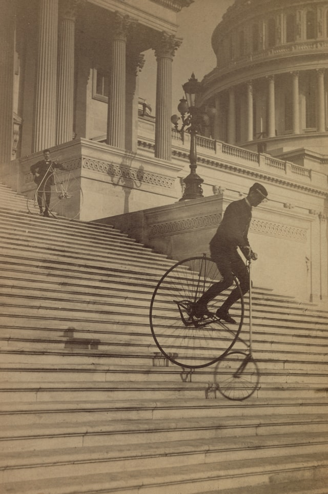
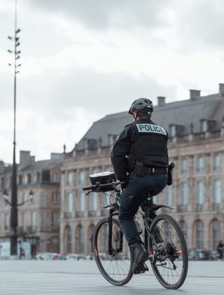
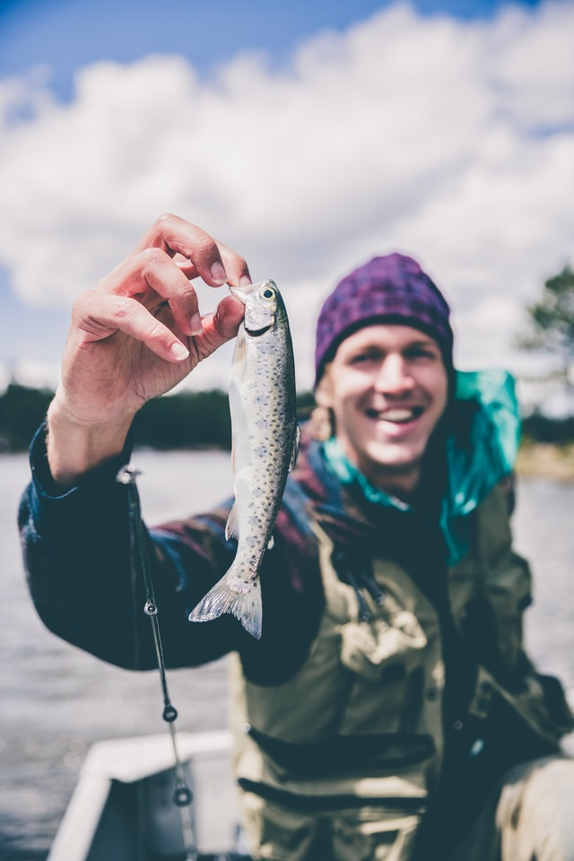
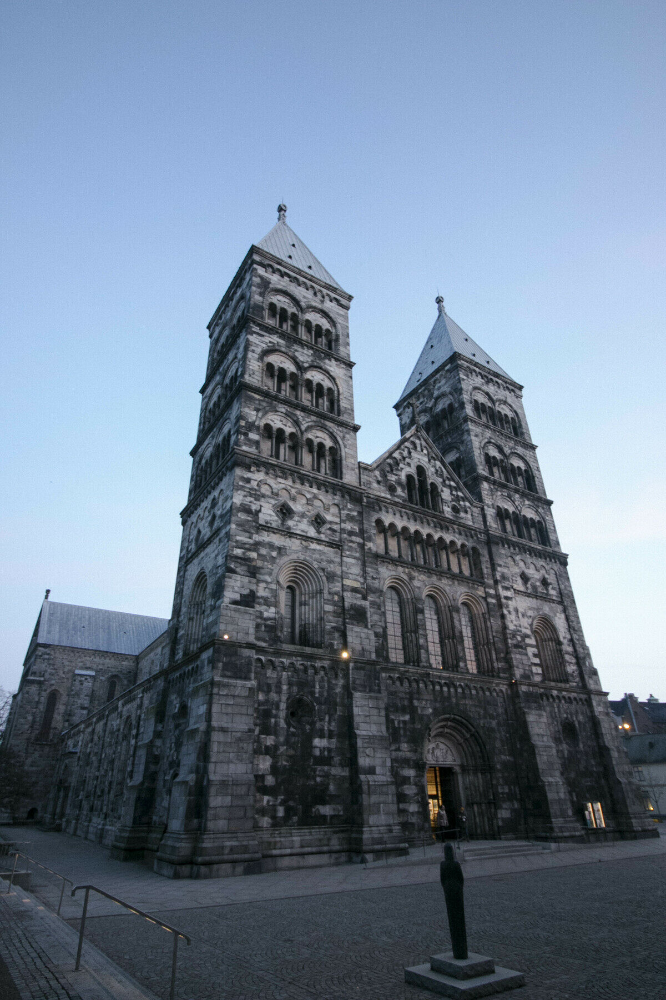
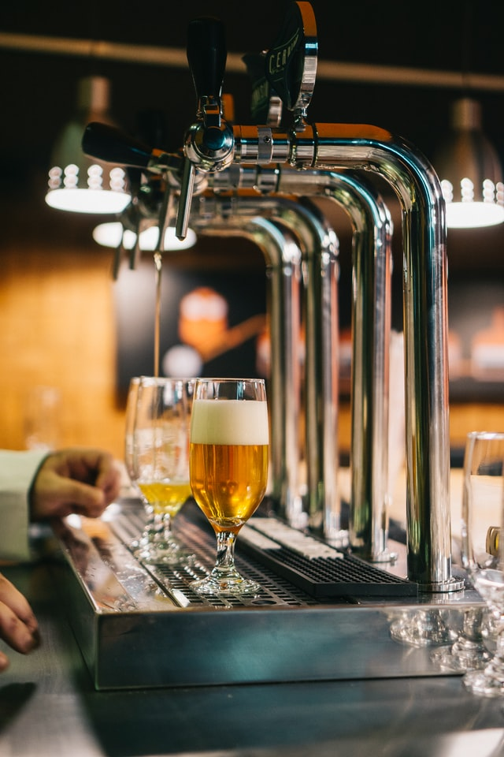
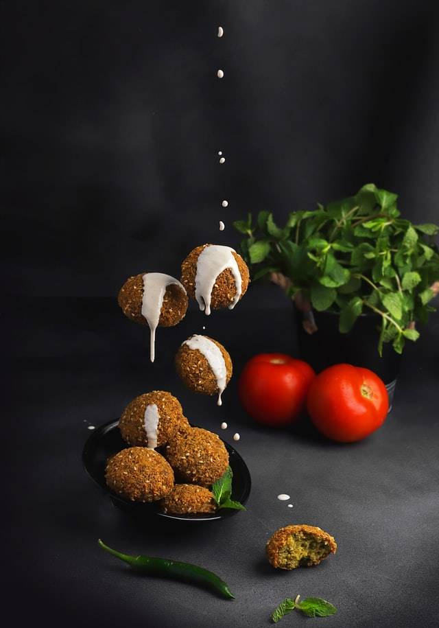
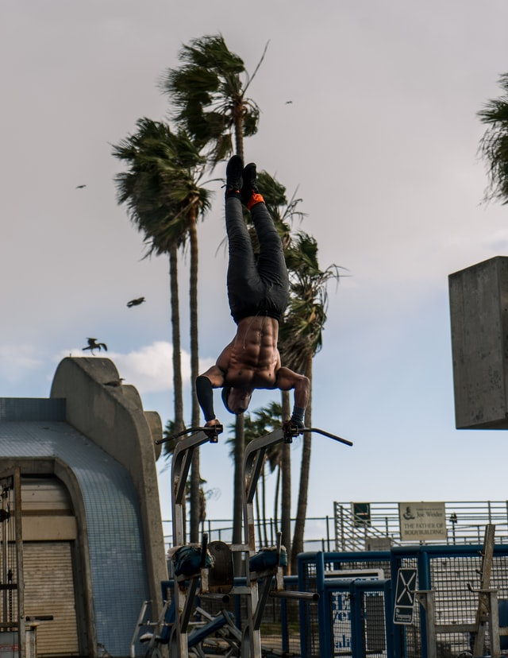

class: hide-logo
background-image: url(pics/vegetables.PNG)
background-position: center
background-size: contain

---

class: center, bottom, hide-logo
background-image: url(bruce-logo.png)

```{r setup, include=FALSE}
options(htmltools.dir.version = FALSE)
library(tidyverse)
library(leaflet)
library(leaflet.extras)

```

### Sunday 2nd May 2021

---
class: center, middle

# Amazing Race Format

### There are eight challenges and six riddles:

### Take a picture of your team in action to complete the challenge.

### Solving each riddle reveals the clue to the next one!

---

class: inverse, center, middle

# Let's get Started with the challenges!

## You can complete the challenges in any order.

---

# 1. Rule Breakers

.pull-left[

- Take a picture breaking the arbitrary road rules of Lund on a bicycle.

]

.pull-right[



]

.footnote[
[1] [Cycling Rules of Lund](https://www.donkey.bike/sweden-cycling-rules/)
]

---

# 2. Now she want a photo, you already know, though

.pull-left[

- Take a picture with a police officer or guard in Lund.

]

.pull-right[



]

.footnote[
[1] This can be done at any time today.
]

---

# 3. Catch of the Day

.pull-left[

-	Go fishing at the dam in the Botanical gardens (you can get creative with a rod)

]

.pull-right[


]

---

# 4. Impersonation Stations

.pull-left[

-	Recreate an impersonation of the statue of the Virgin Mary outside the cathedral.

]

.pull-right[



]

.footnote[
[1] It's the statue in this picture.
]

---

# 5. Going in circles

.pull-left[
-	Complete the labyrinth outside the cathedral.
]

.pull-right[

]
---
# 6. Beer o'clock

.pull-left[
- That was tiring. Feel like a beer? Enjoy a beer from Ericsson’s Bar
]

.pull-right[

]

---
# 7. I have a hunger!

.pull-left[

- Enjoy a falafel for some energy.

]

.pull-right[



]

---
# 8. Work it out

.pull-left[

- Time for a proper workout. Get a picture with everyone exercising at the outdoor gym.

]

.pull-right[



]

---

class: inverse, center, middle

# Riddle me this!

## To complete the next challenges you solve the riddle, go to where the solution takes you and snap a pic. 
## You'll find the password for the next clue at the spot.

---

# 1. Smells bad, man!

### Last year it was layered with the shit of a chicken, and a great place for outdoor activities. Your next clue lies on top of a misplaced boulder.

.footnote[
[1] [Click here for hint](https://pastebin.com/raw/qjXmLkfW)
]

---
# 2. Choo-choo!

### To get the next clue, tell us, how many braille dots there are on the scale of the map of this place, just outside the entrance.

### Use your answer as the password to get the next clue from the link below. (write it out in letters, not numbers)

.footnote[
[1] [Click here to put in the password](https://pastebin.com/F3nkA3b9)
]

---
# 3. How far now?

### When you get here, walk up the path and look around for a signpost with distances to cities around the world.

### How far is it to Durban, South Africa? (write it in numbers e.g. "1000" in the link below)

.footnote[
[1] [Click here to put in the password](https://pastebin.com/dgSKQ1zM)
]

---
# 4. Floating apples?

### With clothes of green, a bark of a dog, and I am a relative of [Newton](https://www.atlasobscura.com/places/newtons-apple-tree), but tended to float before he came around.

### Find the plaque below this object - it is inscribed with "Beaty of [clue]". Type it in to the link below for the next clue.

.footnote[
[1] [Click here to put in the password](https://pastebin.com/wd3unLH4)
]

---
# 5. How are we going to get there?

### Your next clue lies on the island in this body of water!

---
# 6. Lund's most prized possession!

### An ancient Greek city-state and an epic line in the film [300](https://en.wikipedia.org/wiki/300_(film), where does lund's most prized possession stay?

---

class: center, middle

# Thanks for a fun adventure!
