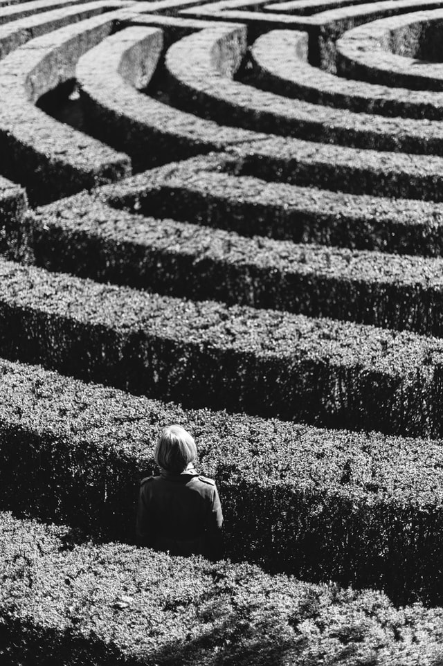

class: center, bottom, hide-logo
background-image: url(bruce-logo.png)

```{r setup, include=FALSE}
options(htmltools.dir.version = FALSE)
library(tidyverse)
library(leaflet)
library(leaflet.extras)

```

### Sunday 2nd May 2021

---
class: center, middle

# Amazing Race Format

### There are five challenges and a few riddles:

### Take a picture of your team in action to complete the challenge.

### Solving each riddle reveals the clue to the next one!


---
class: hide-logo
background-image: url(pics/vegetables.PNG)
background-position: center
background-size: contain

---

```{r, include=F}
hike <- tibble(
  
  lng = c(13.204002, 13.193029, 13.183433),
  
  lat = c(55.703697, 55.703937, 55.697898),
  
  popup = c("Botanical Gardens", "Lund Cathedral", "Outdoor Gym")
  
)

# lund_lomma <- read_csv("international-exchange-week/data/lund_lomma_2.csv")

# lund_lomma <- read_csv("data/lund_lomma_2.csv")


# hike_route <- lund_lomma %>% 
#   as_tibble() %>% 
#   select(lng = X, lat = Y) %>% 
#   mutate(popup = "route")

m <- leaflet() %>%
  addTiles() %>%  # Add default OpenStreetMap map tiles
  addMarkers(
    lng = hike$lng,
    lat = hike$lat,
    popup = hike$popup
             ) %>% 
  # addPolylines(lat = hike_route$lat, 
  #              lng = hike_route$lng) %>% 
  addProviderTiles(providers$CartoDB.Positron)
```


```{r, echo=FALSE}
m  # Print the map
```


---

class: inverse, center, middle

# Let's get Started

---

# Rule Breakers

.pull-left[

- Take a picture breaking the arbitrary road rules of Lund on a bicycle.

]

.pull-right[


]

.footnote[
[1] [Cycling Rules of Lund](https://www.donkey.bike/sweden-cycling-rules/)
]

---
# Catch of the Day

.pull-left[

-	Go fishing at the dam in the Botanical gardens (you can get creative with a rod)

]

.pull-right[


]

---

# Impersonation Stations

.pull-left[

-	Recreate an impersonation of the statue outside the cathedral 

]

.pull-right[


]

---

# Going in circles

.pull-left[
-	Complete the labyrinth outside the cathedral.
]

.pull-right[

]
---
# Beer o'clock

.pull-left[
- That was tiring. Feel like a beer? Buy a beer from Ericsson’s to get your next clue.
- The clue is with the bartender.
]

.pull-right[

]

.footnote[
[1] [If you can't get in click here for hint](https://pastebin.com/raw/s3U6PWSC)
]

---
class: inverse, center, middle

# Photo finish!

## To complete the next challenges you solve the riddle, go to where the solution takes you and snap a pic. 
## You'll find your next clue in the near vacinity.

---

---
# I have a hunger!

.pull-left[

- Buy a falafel from Clemens Falafel
- The next clue is with the falafel man.

]

.pull-right[


]

.footnote[
[1] [If you are lost click for a hint](https://pastebin.com/raw/WK9rGKgQ)
]

---
class: center, middle

# Thanks for a fun adventure!
